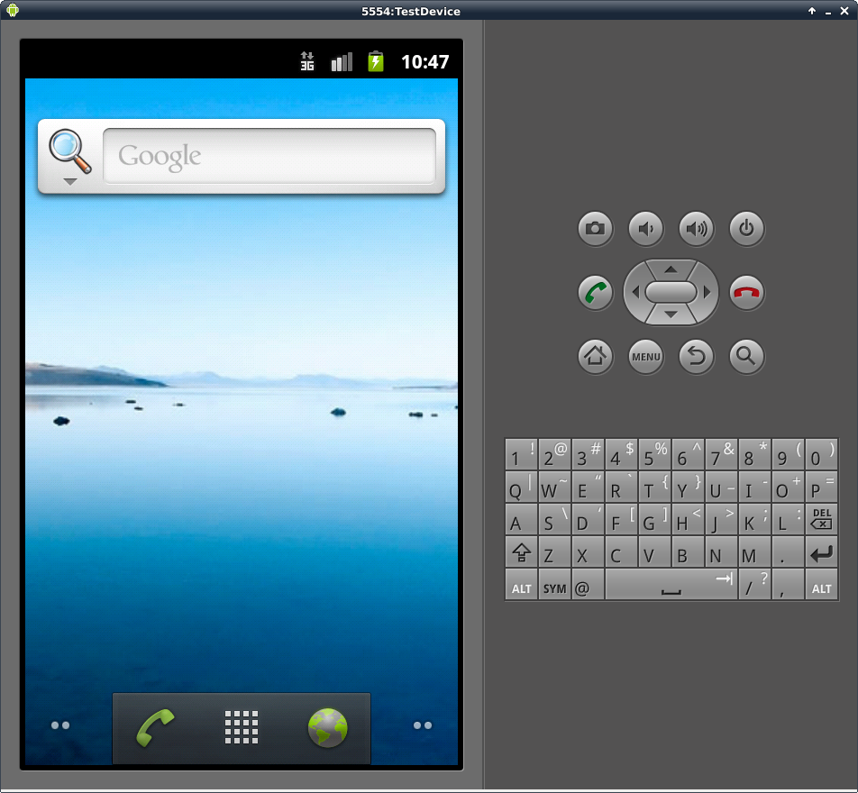
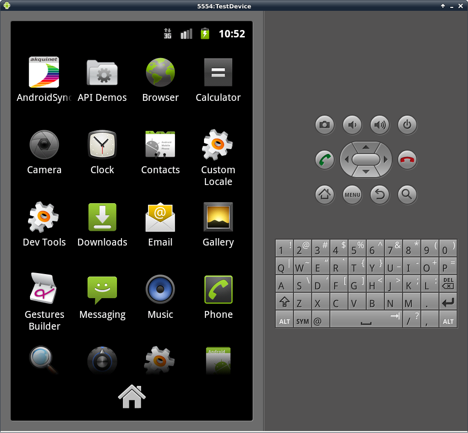
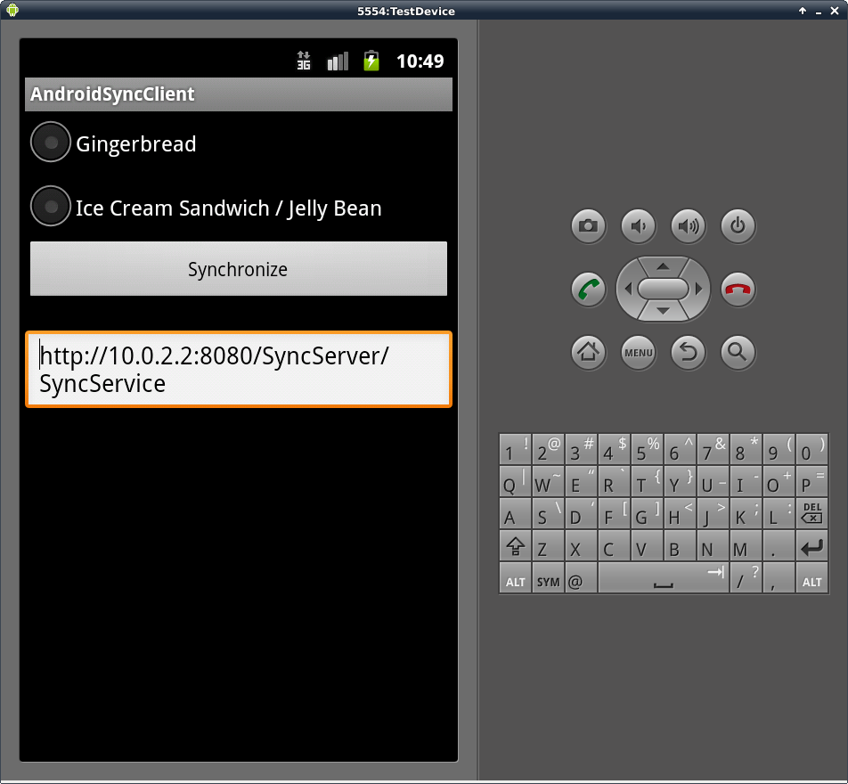
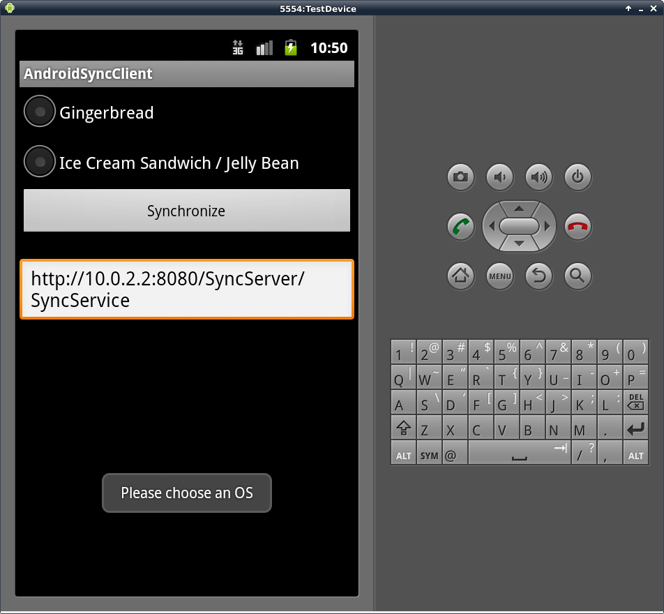
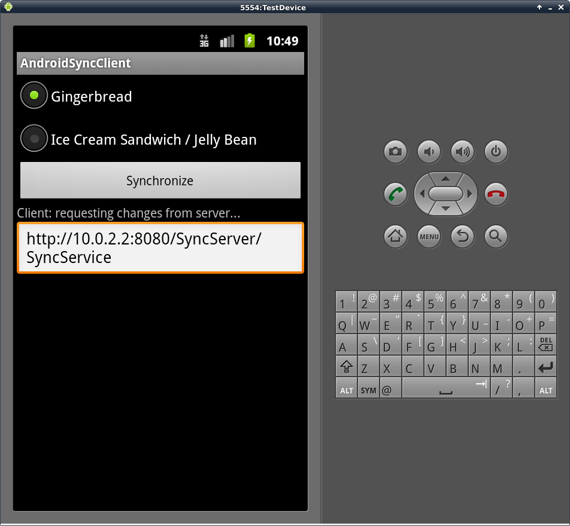
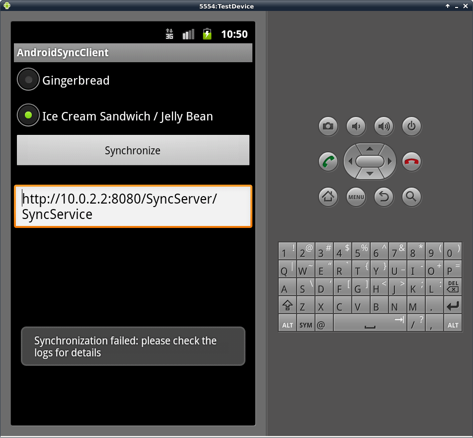
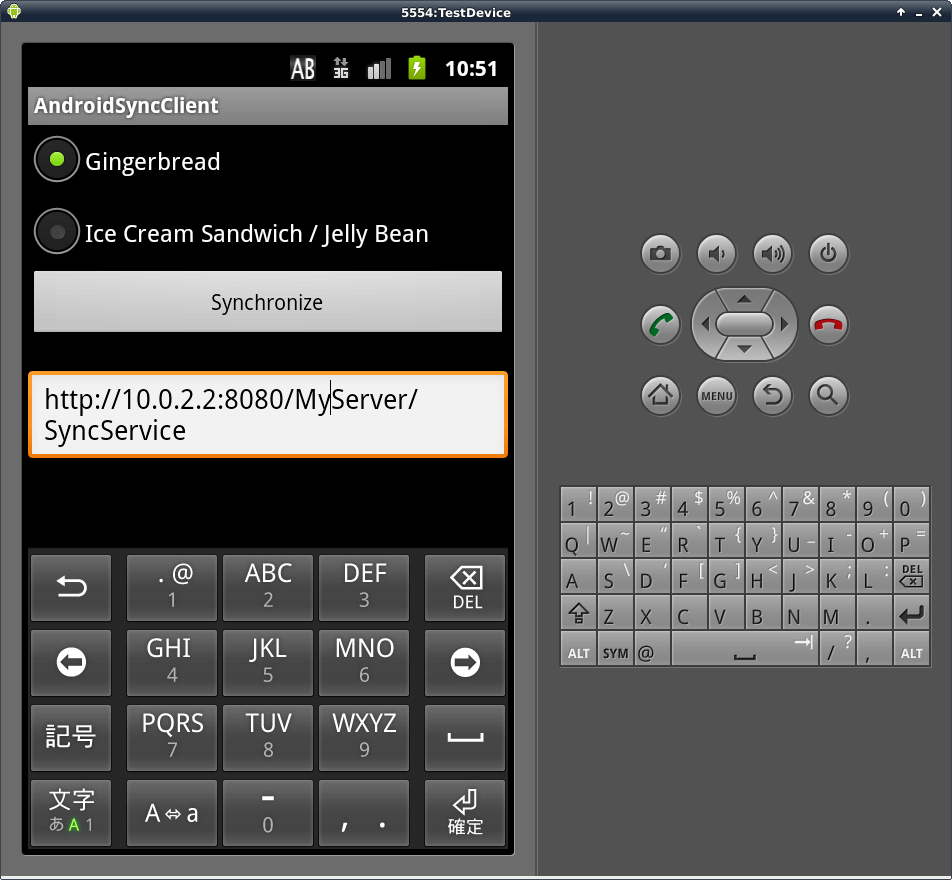

Let's start with the implementation of our Android synchronization client: we want to design a minimalistic GUI where one can choose between the two Android versions 'Gingerbread' and 'Ice Cream Sandwich'.

We also need a Button to start the synchronization, along with a TextField containing the URL of our synchronization service. Finally, a TextLabel will display progress information during the synchronization process.

The pictures below show our client application's GUI on Android Gingerbread:

